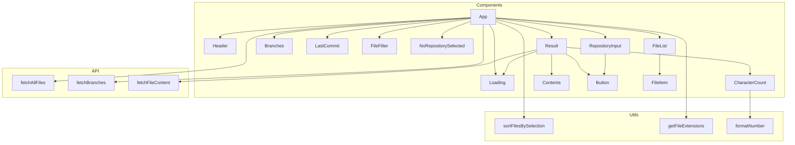

# RepoRanger

RepoRanger is a React application that allows users to explore GitHub repositories and select files to view and copy their contents.

## Features

- Load a GitHub repository by entering its URL
- Browse the files in the repository with a user-friendly interface
- Select files to view their contents
- Copy the contents of selected files to the clipboard

## Architecture
The following diagram shows the high-level architecture and connections between components, utils, and APIs in RepoRanger:



## Getting Started

These instructions will get you a copy of the project up and running on your local machine for development purposes.

### Prerequisites

- Node.js (v12.x or later)
- npm (v6.x or later)

### Installing

1. Clone the repository:

```
git clone https://github.com/isSerge/RepoRanger.git
```

2. Install the dependencies:

```
cd RepoRanger
yarn
```

3. Create a `.env` file in the root of the project and add the following:

```
REACT_APP_GITHUB_TOKEN=your_github_personal_access_token
```

Replace `your_github_personal_access_token` with your GitHub personal access token.

4. Start the development server:

```
yarn start
```
The application will be available at `http://localhost:3000`.

5. To create a production build for deployment, run:
```
yarn build
```
The optimized build output will be in the `build` folder.

## Built With

- [React](https://reactjs.org/) - A JavaScript library for building user interfaces
- [Tailwind CSS](https://tailwindcss.com/) - A utility-first CSS framework for rapidly building custom designs

## License

This project is licensed under the MIT License - see the [LICENSE](LICENSE) file for details.
